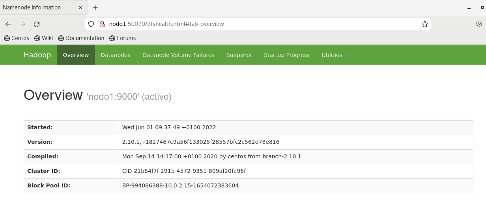

# 2. Instalación pseudo-distribuida

En una instalación pseudo-distribuida (también denominada *single-node cluster*, clúster de un solo nodo), tanto el NameNode como el DataNode residen en la misma máquina.

> [Más información sobre los nodos de Hadoop](../../README.md#nodo-master)

En esta guía, detallaremos como realizar la configuración para usar Hadoop en este modo.

---

En primer lugar, crearemos un directorio denominado *datos* en la raíz de nuestro sistema de ficheros.

```sh
mkdir /datos
```

A continuación, cambiamos el propietario del fichero y el grupo a *hadoop*.

```sh
chown hadoop:hadoop /datos
```

Accederemos al directorio de configuración de Hadoop, que se encuentra en la ruta ```/opt/hadoop/etc/hadoop```.

```sh
cd /opt/hadoop/etc/hadoop
```

Comenzaremos modificando el archivo ```core-site.xml```, que contiene la configuración general del clúster. Se trata de un fichero xml, al que le agregaremos las siguientes líneas:

```xml
<configuration>
    <property>
        <name>fs.defaultFS</name>
        <value>hdfs://nodo1:9000</value>
    </property>
</configuration>
```

> Dentro de la etiqueta *value*, ```nodo1``` hace referencia al nombre de dominio de la máquina en la que estamos. Podríamos poner localhost, pero tendríamos que cambiarlo al migrar a un clúster real.

Posteriormente, modificaremos el fichero ```hdfs-site.xml``` para que quede de la siguiente forma:

```xml
<configuration>
    <property>
        <name>dfs.replication</name>
        <value>1</value>
    </property>
    <property>
        <name>dfs.namenode.name.dir</name>
        <value>/datos/namenode</value>
    </property>
    <property>
        <name>dfs.namenode.data.dir</name>
        <value>/datos/datanode</value>
    </property>
</configuration>
```

> Como solo tenemos 1 nodo, el factor de replicación será 1.
>
> También indicamos el directorio para los metadatos y el directorio para los datos.

A continuación, crearemos los directorios para el namenode y el datanode, en las mismas rutas que especificamos en el fichero de configuración anterior:

```sh
mkdir /datos/namenode
mkdir /datos/datanode
```

Y formateamos el sistema de ficheros que acabamos de crear:

```sh
hdfs namenode -format
```

Tras este comando, si todo está correcto, se nos debe haber creado un directorio *current* dentro de ```/datos/namenode```.

```sh
ls -l /datos/namenode
```

```log
drwxrwxr-x. 2 hadoop hadoop 156 Jun  1 09:37 current
```

A continuación, arrancamos los procesos de HDFS con el siguiente comando, que pondrá en marcha el *NAMENODE*, el *SECONDARY NAMENODE* y el *DATANODE*.

```sh
start-dfs.sh
```

Comprobamos los procesos que se están ejecutando:

```sh
jps
```

```log
4530 DataNode
4709 SecondaryNameNode
4842 Jps
4381 NameNode
```

Por último, accedemos a la web de administración de Hadoop y comprobamos la información de los nodos:

```www
http://nodo1:50070
```

> En la versión 3 de Hadoop, el puerto es el 9870.

