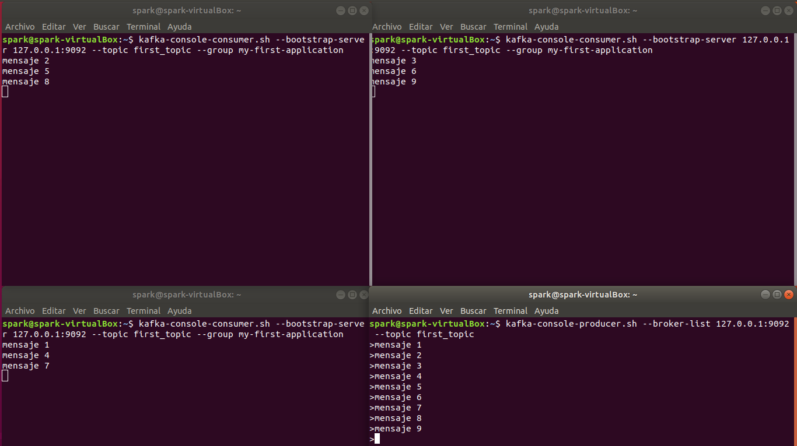

# Guía Práctica de Kafka

Este documento tiene como objeto mostrar operaciones básicas en Kafka. Para ello, emplearemos un máquina virtual Ubuntu con Kafka 2.1.0.

## Arrancar los servicios

La instalación de Kafka se encuentra en la carpeta *kafka_2.11-2.1.0* de nuestro home. Nos situaremos en ella desde dos terminales diferentes, y lanzaremos los siguientes comandos para arrancar los servicios de Zookeeper y Kafka:

Zookeeper

```shell
zookeeper-server-start.sh config/zookeeper.properties
```

Kafka

```shell
kafka-server-start.sh config/server.properties
```

Dejaremos las terminales abiertas para mantener los servicios activos.

## Topics

Abrimos otra terminal y lanzamos el comando:

```shell
kafka-topics.sh
```

Nos mostrará la información del comando y los argumentos que son estrictamente necesarios (los marcados con un REQUIRED).

### Crear un topic

Intentamos crear un topic:

```shell
kafka-topics.sh --zookeeper 127.0.0.1:2181 --topic first_topic --create
```

Al ejecutarlo nos saltará un error, indicando que nos falta indicar el número de particiones. Volvemos a lanzar el comando indicando 3 particiones:

```shell
kafka-topics.sh --zookeeper 127.0.0.1:2181 --topic first_topic --create --partitions 3
```

Nos volverá a dar un error, que esta vez será porque no hemos indicado el factor de replicación:

```shell
kafka-topics.sh --zookeeper 127.0.0.1:2181 --topic first_topic --create --partitions 3 --replication-factor 2
```

Una vez más, nos lanzará un error, puesto que hemos indicado un factor de replicación que es mayor que el número de brokers. Por lo que volvemos a lanzar el comando con factor de replicación 1:

```shell
kafka-topics.sh --zookeeper 127.0.0.1:2181 --topic first_topic --create --partitions 3 --replication-factor 1
```

Ahora sí nos ha creado el topic.

### Listar topics

Podemos comprobar los topics creados mostrando la lista:

```shell
kafka-topics.sh --zookeeper 127.0.0.1:2181 --list
```

### Describir un topic

También podemos describir un topic:

```shell
kafka-topics.sh --zookeeper 127.0.0.1:2181 --topic first_topic --describe
```

### Eliminar un topic

Comenzamos creando otro topic llamado *second_topic*:

```shell
kafka-topics.sh --zookeeper 127.0.0.1:2181 --topic second_topic --create --partitions 6 --replication-factor 1
```

Comprobamos que se ha creado:

```shell
kafka-topics.sh --zookeeper 127.0.0.1:2181 --list
```

Y finalmente lo eliminamos:

```shell
kafka-topics.sh --zookeeper 127.0.0.1:2181 --topic second_topic --delete
```

Y comprobamos que se ha eliminado listando otra vez los topics:

```shell
kafka-topics.sh --zookeeper 127.0.0.1:2181 --list
```

## Producers

Generaremos elementos para insertarlos en los topics de Kafka. Ejecutaremos el comando:

```shell
kafka-console-producer.sh
```

Se nos mostrarán las opciones del comando. Volvemos a lanzar el comando con los argumentos *broker-list* y *topic*:

```shell
kafka-console-producer.sh --broker-list 127.0.0.1:9092 --topic first_topic
```

Todo lo que escribamos ahora en la consola se enviará a nuestro topic. Para salir Pulsamos Ctrl + C.

Volvemos a lanzar el comando, pero esta vez con el argumento *producer-property* y el valor *acks=all*. Esta opción hace que se espere a la sincronización de las réplicas para realizar la confirmación, lo que permite que el registro no se pierda mientras al menos una réplica este levantada.

```shell
kafka-console-producer.sh --broker-list 127.0.0.1:9092 --topic first_topic --producer-property acks=all
```

Escribimos un par de mensajes y salimos con Ctrl + C.

Si intentamos escribir un mensaje en un topic que no existe, Kafka lo creará:

```shell
kafka-console-producer.sh --broker-list 127.0.0.1:9092 --topic new_topic --producer-property acks=all
```

Al mostrar la lista de topics veremos que, efectivamente, se ha creado.

```shell
kafka-topics.sh --zookeeper 127.0.0.1:2181 --list
```

## Consumers

Para consumir los mensajes de Kafka, empleamos el comando:

```shell
kafka-console-consumer.sh
```

Nos mostrará todas las opciones y argumentos necesarios para lanzarlo. Volvemos a lanzarlo añadiendo los argumentos *bootstrap-server* y *topic*:

```shell
kafka-console-consumer.sh --bootstrap-server 127.0.0.1:9092 --topic first_topic
```

Al lanzarlo veremos que no se muestra nada, puesto que solo recogerá los mensajes que entren a partir de ahora. Si abrimos otra terminal y lanzamos un producer que envíe mensajes a *first_topic*, veremos como se nos muestran en nuestro consumer.

Para leer no solo los nuevos mensajes, si no todos desde el inicio del topic, lanzamos el comando con el argumento *from-beginning*:

```shell
kafka-console-consumer.sh --bootstrap-server 127.0.0.1:9092 --topic first_topic --from-beginning
```

Paramos tanto el consumer como el producer mediante Ctrl + C.

## Consumers group

Cada grupo de consumidores se define para una aplicación en concreto, y este es el modo en que se debe realizar el consumo de datos desde Kafka por parte de las aplicaciones cuando se involucra alto rendimiento y concurrencia.

Lanzamos un consumer que forma parte de un consumer group, *my-first-application*:

```sh
kafka-console-consumer.sh --bootstrap-server 127.0.0.1:9092 --topic first_topic --group my-first-application
```

En otra consola, lanzamos un producer para escribir en *first_topic*:

```sh
kafka-console-producer.sh --broker-list 127.0.0.1:9092 --topic first_topic
```

Y por último, abrimos otra consola más de consumer que utilice el mismo grupo de consumo que antes:

```sh
kafka-console-consumer.sh --bootstrap-server 127.0.0.1:9092 --topic first_topic --group my-first-application
```

Si ahora empezamos a mandar mensajes desde el producer, veremos como los consumidores leen los mensajes distribuyéndolos entre los 2 miembros del grupo.

Si lanzamos otro consumer más, veremos como los mensajes se reparten:



### Ejercicios

1. ¿Qué pasaría si cancelamos (CTRL + C) uno de los consumidores (quedando 2) y seguimos enviando mensajes por el producer?

> Uno de los consumers que queda en pie toma el relevo del consumidor que hemos cancelado, de modo que todos los mensajes que hubiesen llegado a ese consumer los lee él.

2. ¿Qué pasaría si canclearamos otro de los consumidores (quedando solo 1) y seguimos enviando mensajes por el producer?

> Todos los mensajes van a parar al consumer que queda levantado.

3. ¿Qué sucede si lanzamos otro consumidor pero de un grupo llamado my-second-application leyendo el topic desde el principio (--from-beginning)?

> Este consumidortiene el registro de todos los mensajes anteriores (aunque no en orden) y todos los mensajes nuevos que lancemos le llegan.

4. Cancela el consumidor y lánzalo de nuevo formando parte del grupo my-second-application. ¿Aparecen ahora los mensajes desde el principio?

> No, puesto que sin la opción --from-beginning, solo aparecen los mensajes nuevos que lleguen.

5. Cancela el consumidor y manda más mensaje a través del producer. Vuelve a lanzar el mensaje formando parte del grupo my-second-aplication. ¿Cuál fue el resultado?

> Los mensajes que se mandaron mientras el consumer no estaba activo sí que aparecen ahora.

### Consumers group command

Por último, veremos las opicones que ofrece el siguiente comando:

```sh
kafka-consumer-groups.sh
```

Por ejemplo, podemos mostrar la lista de grupos mediante el comando:

```sh
kafka-consumer-groups.sh --bootstrap-server 127.0.0.1:9092 --list
```

También podemos obtener información de un grupo por particiones:

```sh
kafka-consumer-groups.sh --bootstrap-server 127.0.0.1:9092 --describe --group my-second-application
```

Podemos resetear el offset del consumer group mediante el comando:

```sh
kafka-consumer-groups.sh --bootstrap-server 127.0.0.1:9092 --group my-first-application--reset-offsets --to-earliest --execute --topic first_topic
```

## Ejercicio final

1. Crear un topic llamado *topic_app* con 3 particiones y factor de replicación 1.

```shell
kafka-topics.sh --zookeeper 127.0.0.1:2181 --topic topic_app --create --partitions 3 --replication-factor 1
```

2. Crear un producer que inserte mensajes en el topic que acabamos de crear.

```shell
kafka-console-producer.sh --broker-list 127.0.0.1:9092 --topic topic_app
```

3. Crear 2 consumer que formen parte de un grupo llamado *my_app*.

Lanzamos en dos terminales diferentes el comando:

```sh
kafka-console-consumer.sh --bootstrap-server 127.0.0.1:9092 --topic topic_app --group my_app
```

4. Interactuar con los 3 elementos creando mensajes en el producer y visualizándolos en los consumers.
5. Listar los topics, los grupos de consumo y describir cada uno de ellos.

Listamos los topics:

```shell
kafka-topics.sh --zookeeper 127.0.0.1:2181 --list
```

Y describimos el topic *topic_app*:

```shell
kafka-topics.sh --zookeeper 127.0.0.1:2181 --topic topic_app --describe
```

Listamos lo grupos:

```sh
kafka-consumer-groups.sh --bootstrap-server 127.0.0.1:9092 --list
```

Y describimos el grupo *my_app*:

```sh
kafka-consumer-groups.sh --bootstrap-server 127.0.0.1:9092 --describe --group my-app
```
